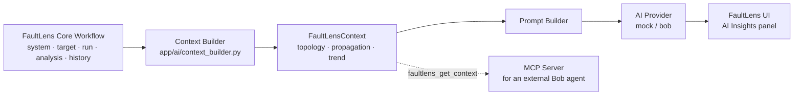
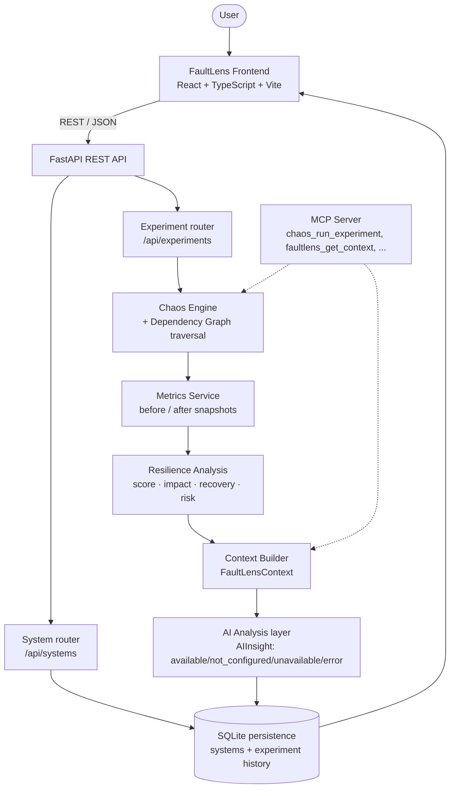

<div align="center">

# ⚡ FaultLens

**AI-Powered Chaos Engineering & Resilience Intelligence**

FaultLens models a distributed system as a **Digital Twin**, injects controlled failures into it, and uses a deterministic simulation engine plus an AI interpretation layer to explain what broke, how far it spread, and how the system recovered.

*Simulate failures. Measure impact. Understand resilience. Let AI explain what happened.*

[](Backend/requirements.txt)
[](Backend/requirements.txt)
[](Frontend/package.json)
[](Frontend/package.json)
[](Frontend/package.json)
[](https://github.com/Samil-dev/codetwin-chaoslab-ai/actions/workflows/ci.yml)
[](Backend/tests)

</div>

> 🖼️ **Screenshots pending.** The dashboard is fully functional (see below), but no
> screenshots have been captured into the repo yet. See
> [`docs/images/README.md`](docs/images/README.md) for exactly what's needed.

---

## Table of contents

- [The Problem](#-the-problem)
- [How FaultLens Works](#-how-faultlens-works)
- [Core Capabilities](#-core-capabilities)
- [Chaos Engineering](#-chaos-engineering)
- [AI-Powered Resilience Intelligence](#-ai-powered-resilience-intelligence)
- [Resilience Analysis](#-resilience-analysis)
- [Architecture](#-architecture)
- [Tech Stack](#-tech-stack)
- [Project Structure](#-project-structure)
- [API](#-api)
- [Getting Started](#-getting-started)
- [Demo](#-demo)
- [Example Workflow](#-example-workflow)
- [Project Status](#-project-status)
- [Roadmap](#-roadmap)
- [Safety](#-safety)
- [Testing](#-testing)

---

## 🎯 The Problem

Modern systems are built from many services that depend on each other. When one of
them fails — a database goes down, a downstream service gets slow, a queue backs
up — the failure rarely stays contained. It propagates along the dependency graph,
and the further it spreads, the harder it is to reason about after the fact:
*which services were actually affected, how badly, and how long did recovery take?*

Chaos Engineering answers this by testing failure on purpose, but two problems
remain even then:

- **Safety** — most teams can't (or shouldn't) run failure experiments against
  real production infrastructure just to learn how it behaves.
- **Interpretation** — a wall of metrics and event logs after an experiment
  doesn't automatically tell you the blast radius, the risk level, or what to
  fix first.

FaultLens addresses both: it runs experiments against a **simulated digital
twin** of the system instead of real infrastructure, and turns the raw
simulation output into a resilience score, a risk classification, and an
AI-generated explanation a human can act on.

## 🔄 How FaultLens Works

```
Digital Twin  →  Select Target  →  Configure Chaos Experiment  →  Run Simulation
     →  Collect Events & Metrics  →  Analyze Impact  →  Calculate Resilience
     →  AI Interpretation  →  Recommendations
```

1. **Digital Twin** — the system under test is a graph of nodes (services,
   databases, caches, queues...) and dependency edges between them.
2. **Select Target** — pick a node on the graph.
3. **Configure Chaos Experiment** — choose a failure type and a duration.
4. **Run Simulation** — the backend's Chaos Engine injects the failure and
   walks the dependency graph to determine which other nodes are affected.
5. **Collect Events & Metrics** — simulation events (`failure_injected`,
   `node_degraded`, `node_recovered`, ...) and before/after metric snapshots
   (CPU, memory, latency, error rate) are recorded for every affected node.
6. **Analyze Impact** — blast radius, critical nodes, and average metric
   impact are computed from the simulation output.
7. **Calculate Resilience** — a deterministic 0–100 resilience score and
   rating (excellent → critical) are derived from blast radius and metric
   impact.
8. **AI Interpretation** — the resilience analysis is turned into a summary,
   a root cause, a risk interpretation, and confidence score.
9. **Recommendations** — both a deterministic rules engine and the AI layer
   surface concrete next steps.

The result is persisted, shown in the Resilience Panel, and can be replayed
from **History** or compared against other runs in **Compare Scenarios**.

## ⚡ Core Capabilities

| Capability | What it does |
|---|---|
| 🌐 **Digital Twin** | Models a system as nodes + dependencies and renders it as an interactive, auto-laid-out graph. |
| 💥 **Chaos Engineering** | Injects one of four failure types into a chosen node and simulates its propagation. |
| 📊 **Resilience Analysis** | Computes a resilience score, blast radius, critical nodes, and average metric impact. |
| 🧠 **AI Insights** | Interprets the resilience analysis into a summary, root cause, risk interpretation, and recommendations. |
| 📈 **Metrics** | Before/after comparison of CPU, memory, latency, and error rate per node, with charts. |
| 🔄 **Recovery Analysis** | Tracks recovery status and timing per node, and flags nodes that failed to recover. |
| ⚠️ **Risk Assessment** | Classifies each experiment's outcome as low / moderate / high / critical, with a stated reason. |
| 🔗 **Dependency Graph** | Deterministic, cycle-free graph traversal drives which nodes are affected by a given failure. |
| 🧪 **Scenario Comparison** | Compares 2–4 past experiment runs side by side. |
| 📜 **Experiment History** | Every run is persisted and can be reloaded into the dashboard. |

## 💥 Chaos Engineering

FaultLens currently supports four experiment types, each simulated
deterministically against the digital twin:

| Type | Effect |
|---|---|
| **Service Down** | Takes the target node fully offline (`failed`); dependents lose connectivity. |
| **Latency Spike** | Injects high response latency into the target node. |
| **Resource Exhaustion** | Saturates the target node's simulated CPU and memory. |
| **Traffic Spike** | Simulates a sudden request-volume overload, raising error rate and latency. |

All four propagate to dependent nodes through the same dependency-graph
traversal, just with different metric signatures and severities.

> **These are simulations.** FaultLens does not attack, throttle, or otherwise
> touch real infrastructure — every metric, event, and recovery time is
> generated by the simulation engine against the in-memory digital twin.

## 🧠 AI-Powered Resilience Intelligence

After each experiment, an AI analysis layer turns the resilience analysis
into a structured, human-readable interpretation. The response is never
assumed to succeed — `ai_analysis` on an experiment result is an **AIInsight**
with an explicit `status`, so a provider failure can never take the rest of
the experiment (metrics, propagation, resilience analysis) down with it:

| Status | Meaning |
|---|---|
| `available` | A real interpretation was produced — `analysis` is populated. |
| `not_configured` | The selected provider needs credentials/config that aren't set. |
| `unavailable` | The provider is configured but couldn't be reached (transient). |
| `error` | The provider was invoked but failed unexpectedly. |

When `status` is `available`, `analysis` carries:

| Field | Description |
|---|---|
| `summary` | A natural-language summary of what happened during the experiment. |
| `root_cause` | The most likely root cause, referencing the target node and the measured blast radius. |
| `risk_interpretation` | An explanation of the assigned risk level, recovery time, and any failed recoveries. |
| `recommendations` | Recommendations carried over from the deterministic analysis, explained by the AI layer. |
| `confidence` | A confidence score for the interpretation. |
| `provider` | Which AI provider generated the response. |

The AI layer sits behind a provider interface (`BaseAIProvider`), selected via
an `AI_PROVIDER` environment variable. **Today the only implemented provider
is a deterministic, offline "mock" provider** that builds its explanation
directly from the simulation's real numbers (blast radius, recovery time,
critical nodes) — it is clearly labeled `provider: "mock"` in every response
and is never presented as IBM Bob. A `BobAIProvider` stub also exists
(`AI_PROVIDER=bob`) — see [IBM Bob Integration](docs/ai-integration.md) for
exactly what's connected today (the MCP path) versus what's prepared but not
yet wired to a real endpoint (the in-app provider path).

### FaultLens AI Context Pipeline

Whichever provider is active, it's grounded in more than the single result
that triggered it. A `FaultLensContext` — system topology, the propagation
path, resilience analysis, critical nodes, and a compact history trend —
is assembled from real, already-persisted data (see
`app/ai/context_builder.py`) and fed into the prompt:



The same `FaultLensContext` is also exposed as an MCP tool
(`faultlens_get_context`) — see **Architecture** below and
[docs/ai-integration.md](docs/ai-integration.md) for the full picture.

## 🛡️ Resilience Analysis

| Metric | Meaning |
|---|---|
| **Resilience Score** | 0–100 score combining blast radius and metric impact. |
| **Rating** | Human-readable band: excellent, good, moderate, poor, critical. |
| **Affected Nodes** | How many nodes were impacted, out of the system's total. |
| **Blast Radius** | Affected nodes as a percentage of the whole system. |
| **Critical Nodes** | Nodes whose metrics changed enough to be flagged as high-impact. |
| **Metric Impact** | Average normalized change across CPU, memory, latency, and error rate. |
| **Recovery** | Recovered vs. total nodes, average and maximum recovery time, and any failed recoveries. |
| **Risk Level** | low / moderate / high / critical, with a stated deterministic reason. |
| **Recommendations** | Prioritized, rule-based suggestions (e.g. reduce blast radius, improve recovery time). |

## 🏗️ Architecture



- **Frontend** renders the digital twin, drives experiments, and visualizes
  every layer of the analysis. It talks to the backend exclusively over REST.
- **FastAPI REST API** exposes systems and experiments as resources.
- **Chaos Engine** validates the target node, dispatches to the right failure
  handler, and uses the **Dependency Graph** (BFS over the reverse dependency
  graph) to compute which nodes are transitively affected.
- **Metrics Service** produces deterministic before/after metric snapshots
  per node, shaped by the experiment type.
- **Resilience Analysis** turns the simulation output into a score, impact,
  recovery, risk, and recommendations.
- **Context Builder** assembles a `FaultLensContext` (topology, propagation,
  history) from real persisted data — the same context feeds both the in-app
  AI Analysis layer and the MCP server.
- **AI Analysis layer** interprets that context into natural language,
  reporting an explicit `AIInsight` status rather than assuming success.
- **Persistence** stores systems and experiment history in SQLite.
- **MCP Server** exposes the same chaos/resilience orchestration — plus the
  structured `FaultLensContext` — as tools for MCP-compatible clients
  (including IBM Bob, see below), independent of the REST API.

## 🔧 Tech Stack

| Layer | Technology | Purpose |
|---|---|---|
| Frontend | React 18 + TypeScript, Vite | Dashboard UI and build tooling |
| Frontend state | Zustand | Global app/store state (system, selection, experiment phase, results, history) |
| Frontend charts | Recharts | Before/after metrics visualization |
| Frontend graph | Custom SVG (auto-layout) | Digital Twin dependency graph rendering and animation |
| API | FastAPI + Pydantic | REST API, request/response validation |
| Simulation | Custom Python engine | Chaos experiment execution, dependency graph traversal |
| Analysis | Custom Python engine | Resilience scoring, impact/recovery/risk analysis, recommendations |
| AI | Custom provider interface | Structured AI interpretation of resilience analysis |
| Persistence | SQLite (Python `sqlite3`) | Systems and experiment history storage |
| Integration | MCP (Model Context Protocol) | Exposes chaos/resilience tools to MCP clients |
| Testing | pytest, FastAPI `TestClient` | Backend unit + integration tests |
| CI | GitHub Actions | Backend tests + frontend build on every push/PR |

## 📁 Project Structure

```
FaultLens/
├── Backend/
│   ├── app/
│   │   ├── api/          # FastAPI routers (health, systems, experiments)
│   │   ├── models/        # Pydantic models — the API contract
│   │   ├── chaos/         # Chaos Engine (failure injection + propagation)
│   │   ├── graph/         # Dependency graph + cycle validation
│   │   ├── analysis/      # Impact / recovery / risk / recommendation analyzers
│   │   ├── services/      # Orchestration layer (chaos, metrics, resilience, AI, persistence)
│   │   ├── ai/             # AI analyzer, prompt builder, provider interface
│   │   └── mcp/           # MCP server exposing chaos/resilience tools
│   └── tests/              # pytest suite (199 tests)
│
├── Frontend/
│   └── src/
│       ├── components/
│       │   ├── graph/      # DependencyGraph, GraphNode, GraphEdge
│       │   ├── experiment/ # GraphCanvas, ExperimentModal
│       │   ├── layout/     # Header, LeftSidebar, RightPanel
│       │   ├── panels/     # MetricsPanel, ComparisonPanel
│       │   └── ui/         # ScoreRing, StatusBadge
│       ├── store/          # Zustand store
│       ├── services/       # API client
│       └── types/          # Shared TypeScript API types
│
├── docs/
│   ├── architecture/       # Original design docs
│   └── images/             # Screenshots (see docs/images/README.md)
│
├── .github/workflows/      # CI (backend tests + frontend build)
└── README.md
```

## 🔌 API

Base URL in development: `http://localhost:8000`, prefix `/api`.

| Method | Endpoint | Description |
|---|---|---|
| `GET` | `/api/health` | Backend liveness check. |
| `POST` | `/api/systems/` | Create (validate + persist) a digital twin system. |
| `GET` | `/api/systems/` | List all persisted systems. |
| `POST` | `/api/experiments/run` | Run a chaos experiment against a system and return the full result (run, events, comparisons, resilience score, analysis, AI insight). |
| `GET` | `/api/experiments/?system_id={id}` | List persisted experiment runs, optionally filtered by system. |
| `POST` | `/api/experiments/suggest-next?last_target_node={id}&system_id={id}` | Suggest a follow-up experiment. `system_id` (optional) makes it consider real persisted history — preferring untested nodes and varying the experiment type — instead of just the posted analysis. |
| `POST` | `/api/experiments/compare` | Compare 2–4 previously-run experiments side by side. |

Full request/response shapes live in the Pydantic models under
`Backend/app/models/` — they are the source of truth for the contract.

## 🚀 Getting Started

### Requirements

- Python 3.11+ (developed and tested with 3.14)
- Node.js 18+ (developed and tested with Node 22)

### Backend

```bash
cd Backend
python -m venv venv
venv\Scripts\python.exe -m pip install -r requirements.txt -r requirements-dev.txt
venv\Scripts\python.exe -m uvicorn app.main:app --reload --port 8000
```

The backend seeds a demo "E-Commerce Platform" digital twin on first run, so
`GET /api/systems` is never empty.

### Frontend

```bash
cd Frontend
npm install
npm run dev
```

Open `http://localhost:3000`.

On Windows, `start.bat` (repository root) launches both and opens the
dashboard automatically.

### Environment Variables

See [`Backend/.env.example`](Backend/.env.example):

| Variable | Default | Purpose |
|---|---|---|
| `CODETWIN_DATABASE_PATH` | `Backend/codetwin.sqlite3` | SQLite file location. |
| `AI_PROVIDER` | `mock` | Selects the AI provider used for experiment analysis (`mock` or `bob`). |
| `BOB_API_ENDPOINT` | *(unset)* | Only used when `AI_PROVIDER=bob`. Not connected to a real endpoint today — see [docs/ai-integration.md](docs/ai-integration.md). |
| `BOB_API_KEY` | *(unset)* | Only used when `AI_PROVIDER=bob`. Backend-only; never sent to or read by the frontend. |

No API keys are required to run FaultLens today: the default `mock` provider
is offline, and `bob` (without credentials) reports an honest
`not_configured` status rather than failing the experiment.

## 🎥 Demo

> Demo coming soon. For now, FaultLens runs locally — see **Getting Started**
> above.

## 🧩 Example Workflow

1. Load the digital twin (seeded automatically — a 10-node e-commerce system).
2. Select a service on the graph, e.g. `Primary Database`.
3. Configure a failure — for example, **Service Down** for 30 seconds.
4. Run the simulation and watch the failure propagate through dependent nodes.
5. Observe which nodes were affected and the resulting blast radius.
6. Review the resilience score and risk classification.
7. Inspect recovery time per node.
8. Read the AI analysis — summary, root cause, risk interpretation (or, with
   `AI_PROVIDER=bob` and no credentials set, an honest "not configured" notice
   instead of a fabricated response).
9. Review the recommendations, and optionally compare this run against a
   previous one in **Compare Scenarios**.

## 🚧 Project Status

### ✅ Implemented

- Digital twin system model with cycle-free dependency graph validation,
  duplicate/missing-reference rejection, and a rejected empty architecture
- Four chaos experiment types with dependency-aware failure propagation
- Deterministic before/after metrics simulation
- Full resilience analysis: score, impact, recovery, risk, recommendations
- AI interpretation layer with an explicit `AIInsight` status
  (available / not_configured / unavailable / error) — a provider failure
  can never take down an otherwise-successful experiment result
- `FaultLensContext` pipeline: system topology, propagation, and history are
  assembled from real persisted data and fed into the AI prompt and into an
  MCP tool (`faultlens_get_context`), instead of an isolated single result
- History-aware `suggest_next_experiment`: prefers never-tested nodes and
  varies the suggested experiment type when given a `system_id`
- SQLite persistence for systems and experiment history, auto-seeded demo
  system, tolerant of rows from an older schema version
- Scenario comparison across 2–4 runs
- MCP server exposing chaos/resilience tools plus the structured
  FaultLens context — this is FaultLens's real, working integration
  surface for an external IBM Bob agent (see
  [docs/ai-integration.md](docs/ai-integration.md))
- React dashboard fully wired to the live backend: dependency graph with
  propagation animation, experiment modal, resilience panel, metrics charts,
  history, scenario comparison, and a real "no systems yet" empty state
- Correct system-switching: importing/switching systems clears the previous
  system's result, selection, comparison, and recommendation state
- 237 backend tests; a 5-spec Playwright suite (Core Workflow, persistence &
  switching, and hardening: system-switch isolation + import validation)
  driving the real UI against the real backend; CI running backend tests +
  frontend build

### 🔨 In Progress

- No real external LLM provider connected yet — `mock` (offline,
  deterministic) is the default; `bob` is a prepared-but-unconnected stub
  (see [docs/ai-integration.md](docs/ai-integration.md))
- Repository screenshots (see [`docs/images/README.md`](docs/images/README.md))

### 🔮 Planned

- A real IBM Bob (or other LLM) in-app provider connection, using the
  existing `BaseAIProvider` interface and `BobAIProvider` stub
- WebSocket-based live simulation events, replacing the current
  request/response run cycle
- Authentication and multi-user / multi-system support
- Longer-term resilience-score trend analysis in `suggest_next_experiment`,
  beyond the current per-node history summary

## 🗺️ Roadmap

**Phase 1 — Core Platform** ✅
Digital twin modeling, dependency graph, REST API, persistence.

**Phase 2 — Resilience Intelligence** ✅
Chaos experiments, metrics simulation, resilience/impact/recovery/risk analysis, scenario comparison.

**Phase 3 — AI Interpretation** ✅ (mock provider + context pipeline) / 🔮 (real provider)
Structured AI analysis grounded in a real `FaultLensContext`, with explicit
failure states; connecting `BobAIProvider` to a real IBM Bob endpoint is next.

**Phase 4 — Advanced Simulation**
Live (WebSocket) simulation events, richer failure modes, larger/imported system topologies.

**Phase 5 — Production Readiness**
Authentication, multi-tenant systems, frontend test coverage, deployment target.

## 🔐 Safety

FaultLens experiments are **simulations**. They run against an in-memory
digital twin — a graph of nodes and dependencies described in a request
payload — not against real services, containers, or infrastructure. No
network calls, process kills, or resource throttling are performed outside
the simulation engine. This makes FaultLens safe to run repeatedly, in any
environment, without risk to production systems.

Any AI provider credentials (`BOB_API_KEY`, etc.) are read from backend
environment variables only — never sent to, stored in, or read by the
frontend. `.env` files are git-ignored; only `.env.example` (no real values)
is committed.

## 🧪 Testing

**Backend:** 237 tests, all passing, using `pytest` + FastAPI's `TestClient`
(full integration tests against the real app, with SQLite redirected to a
temp file per test session). Coverage includes the chaos engine, dependency
graph traversal, metrics service, resilience scoring, system import
validation, the AI context pipeline, MCP tools, AI-provider-failure
isolation, and the complete system/experiment/comparison API surface.

```bash
cd Backend
venv\Scripts\python.exe -m pytest
```

**Frontend:** validated via TypeScript's compiler, a production build, and a
Playwright end-to-end suite driving the real UI against the real backend
(no internal function calls, no mocked responses):

```bash
cd Frontend
npm run build

# In two other terminals, first start both dev servers (see Getting
# Started), then:
npx playwright test
```

The suite covers the full Core Workflow (import → Digital Twin → experiment
→ propagation → resilience → recommendation → history → reload), system
persistence & switching, and hardening checks (system-switch data isolation,
import validation error surfacing).

**CI:** backend tests and the frontend build run automatically on every push
and pull request to `main` (see
[`.github/workflows/ci.yml`](.github/workflows/ci.yml)); Playwright requires
both servers running and is currently run locally, not in CI.
